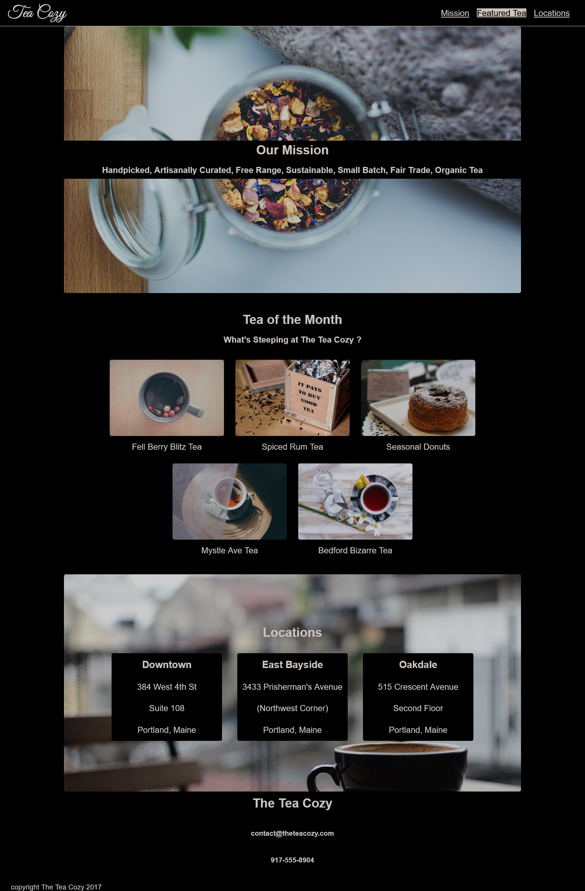

# Codecadmy - Create a fictional tea shop website.

This is a solution to the [Tea Shop Website Project on Codecademy](https://www.codecademy.com/).

## The challenge

Create a fictional Tea Shop Website using a design spec.

### Screenshot

## Links

- Solution URL: (https://github.com/marianarainha/codecademy-tea-shop-website-challenge)
- Live Site URL: (https://marianarainha.github.io/codecademy-tea-shop-website-challenge)

## Built with

- Semantic HTML5 markup
- Flexbox
- Media queries
